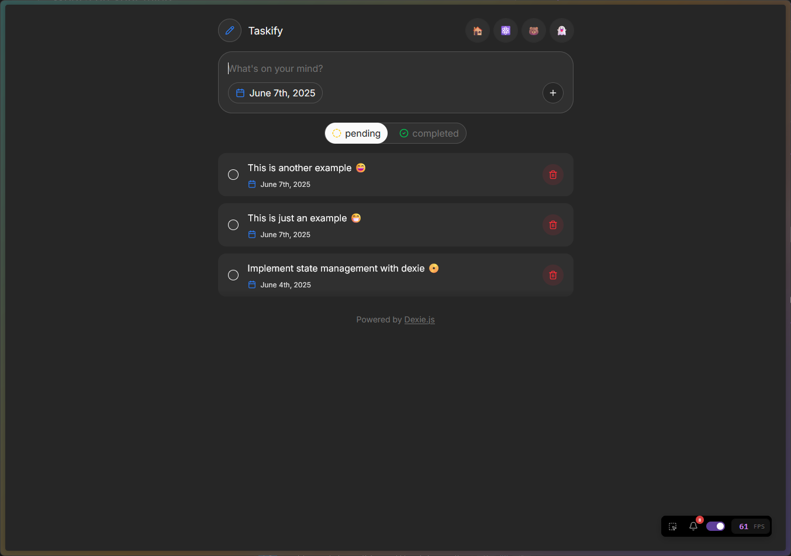

# Taskify Todo App

Your advanced todo app for efficient task management. Built with React, React Router(v7), Tailwind, DexieJS, Shadcn UI.

## Features

- 📝 Create, edit, and delete tasks with ease
- 📅 Set due dates for task
- 🌓 Light and dark mode support
- 💾 Offline support with local storage (DexieJS)
- 🖱️ Intuitive and responsive UI with Shadcn components
- 🧩 **Compare State Management:**
  - The app demonstrates different state management solutions on different routes:
    - **Redux**
    - **Zustand**
    - **Jotai**



## Getting Started

### Installation

Install the dependencies:

```bash
npm install
```

### Development

Start the development server with HMR:

```bash
npm run dev
```

Your application will be available at `http://localhost:5173`.

## Building for Production

Create a production build:

```bash
npm run build
```

## Deployment

### Docker Deployment

To build and run using Docker:

```bash
docker build -t my-app .

# Run the container
docker run -p 3000:3000 my-app
```

The containerized application can be deployed to any platform that supports Docker, including:

- AWS ECS
- Google Cloud Run
- Azure Container Apps
- Digital Ocean App Platform
- Fly.io
- Railway

### DIY Deployment

If you're familiar with deploying Node applications, the built-in app server is production-ready.

Make sure to deploy the output of `npm run build`

```text
├── package.json
├── package-lock.json (or pnpm-lock.yaml, or bun.lockb)
├── build/
│   ├── client/    # Static assets
│   └── server/    # Server-side code
```

---

Built with ❤️ using React Router.
